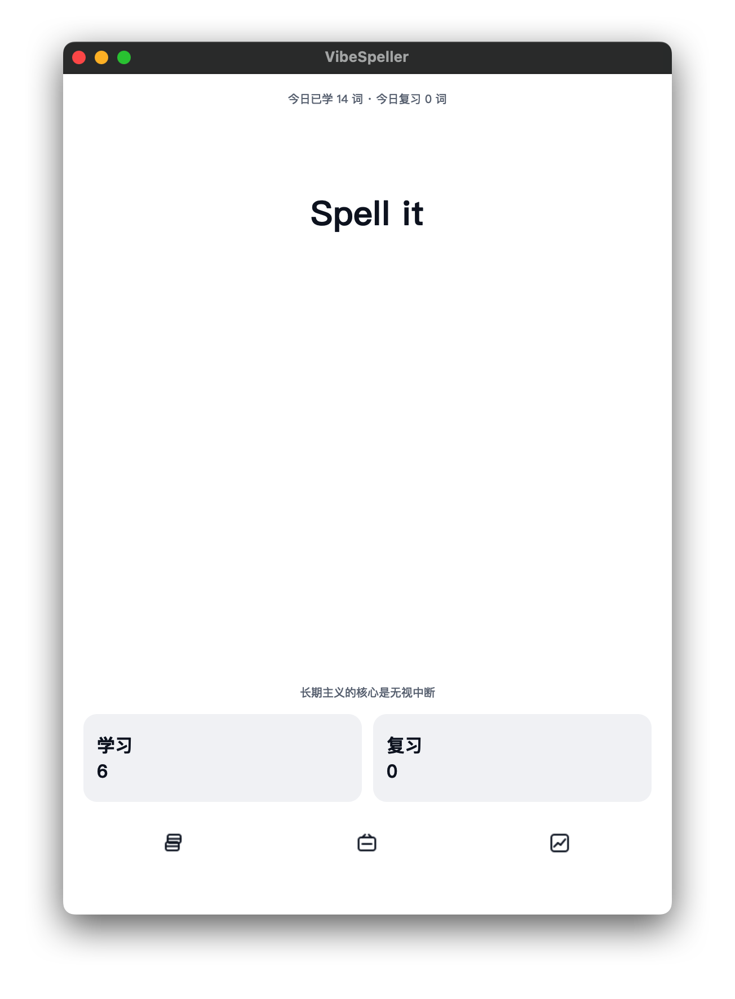
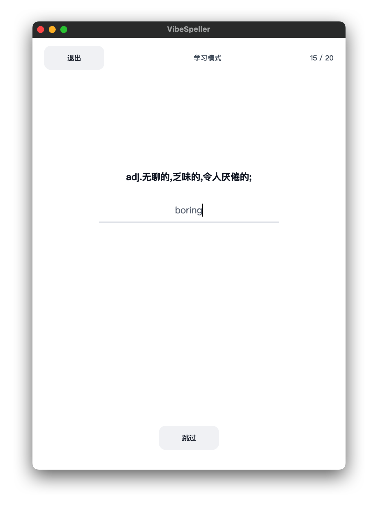
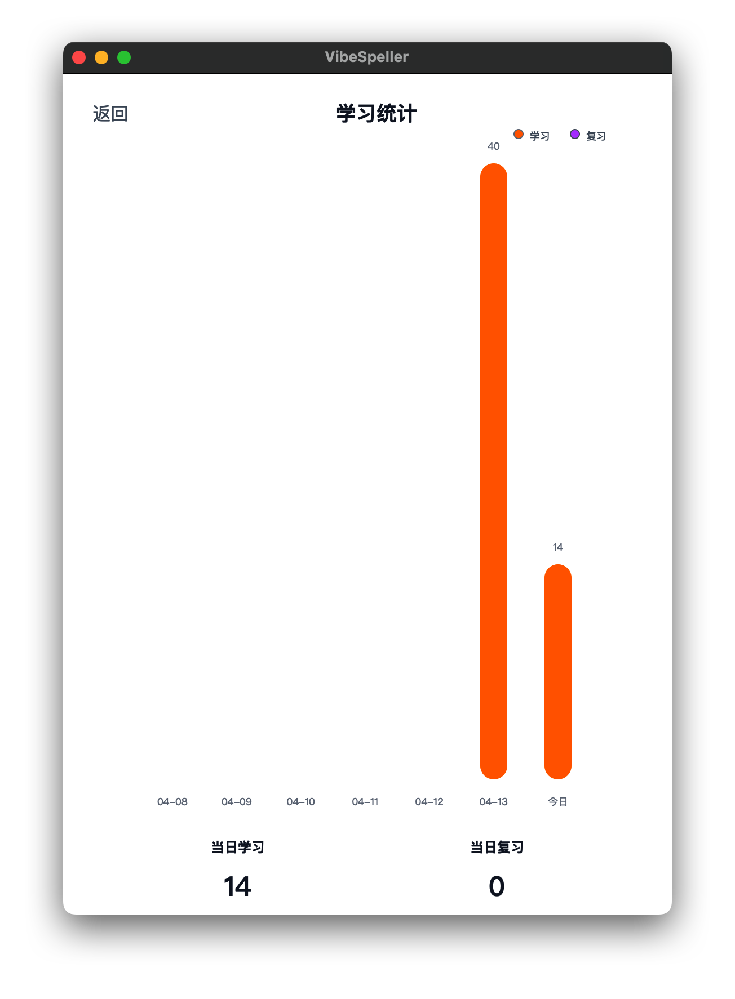

# VibeSpeller

一个面向拼写训练的极简单词复习工具。  
我做它的原因很简单：备考时不仅要“认识单词”，更要“拼得出来”。

VibeSpeller 参考了记忆曲线安排复习的思路，但把训练核心放在拼写本身，减少决策负担，专注每天稳定推进。

## 功能概览

- 学习模式：每组 20 词，从当前词书里抽取未学习单词。
- 复习模式：每组 20 词，从当前词书里抽取 `next_review <= now` 的到期单词。
- 拼写判定：
  - 完全正确：`熟悉`
  - Levenshtein 距离 `1-3`：`模糊`
  - 距离 `>3` 或跳过：`不熟悉`
- 艾宾浩斯复习阶梯：`1, 2, 4, 7, 15, 30` 天。
- 练习中途退出可续练：下次继续同一组 20 词。
- 小结页：正确率 + 错词列表 + 继续下一组。
- 学习统计页：按天展示学习/复习量。
- 词书管理页：
  - 首页左下角进入词书页
  - 当前词书高亮，并显示“正在学习”
  - 支持添加词书（CSV 导入）
  - 支持删除词书（双重确认弹窗）

## 截图

请先将图片放到 `assets/screenshots/` 目录，再使用下面这些占位路径。

### 首页



### 拼写页



### 统计页



### 词书页


## 项目结构

```text
.
├── CMakeLists.txt
├── database_manager.h
├── database_manager.cpp
├── gui_widgets.h
├── gui_widgets.cpp
└── main.cpp
```

## 技术栈

- C++17
- Qt 6 (`Widgets`, `Sql`)
- SQLite（通过 QtSql）
- CMake 3.16+

## 编译与运行

在项目根目录执行：

```bash
cmake -S . -B build
cmake --build build -j4
./build/VibeSpeller
```

如果 CMake 找不到 Qt：

```bash
cmake -S . -B build -DCMAKE_PREFIX_PATH="/path/to/Qt/6.x.x/macos"
```

## CSV 导入说明

导入时会先读取 CSV 表头，并在界面中映射：

- 单词列（必选）
- 释义列（必选）
- 音标列（可选）

CSV 解析支持：

- 引号包裹字段
- 字段内逗号
- 引号内换行（跨行字段）

## 数据与存储

- 数据库文件：项目根目录 `vibespeller.db`
- 主要数据：
  - 单词与复习状态
  - 词书信息与当前词书
  - 每日学习/复习统计
  - 会话续练进度

## 设计目标

- 极简、白底、低干扰
- 默认竖屏比例体验
- 所有 UI 用代码实现，便于快速迭代和按个人习惯调整

